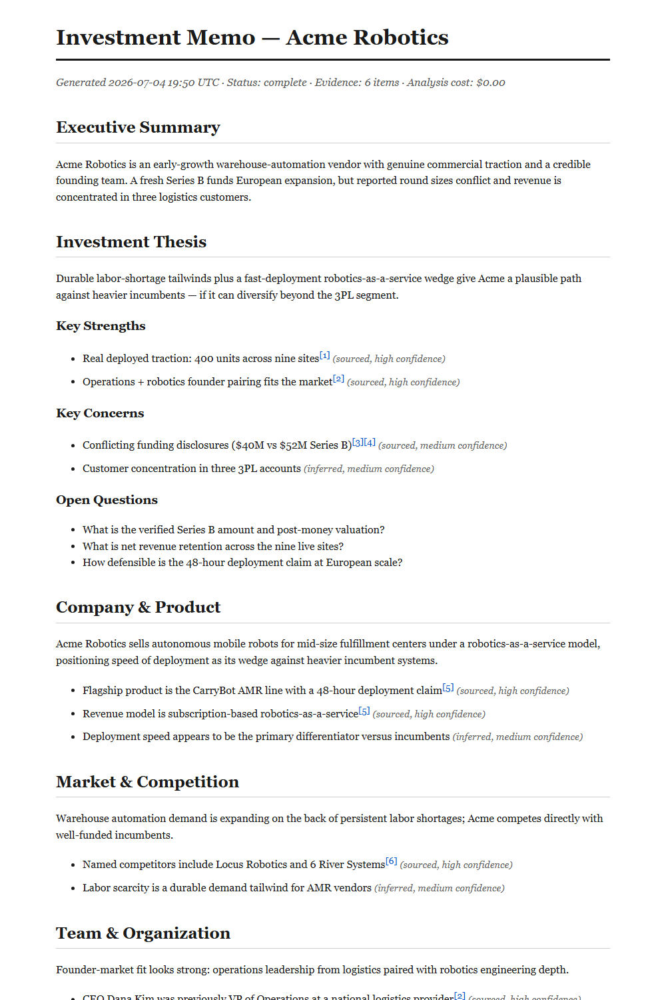
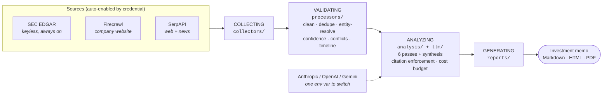
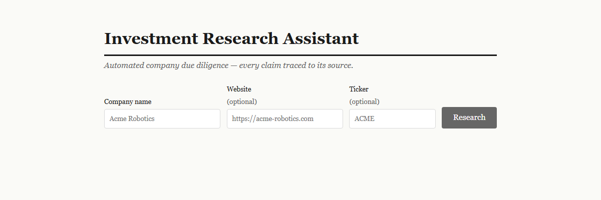

# Investment Research Assistant

**AI due diligence that shows its receipts.** Give it a company name — it collects evidence from SEC filings, the company's website, and news search, validates and scores every datum, runs a citation-enforced LLM analysis, and delivers an investment memo where **every factual claim is a numbered footnote back to its source**. Export as Markdown, HTML, or PDF.

[](https://github.com/DarkWaterReflection/Investment-Research-Assistant/actions/workflows/ci.yml)


---

## Why it's different

Most LLM research tools hand you fluent prose and ask for your trust. This one is built on a harder rule: **an unsourced or mis-attributed fact is worse than a missing one.**

- 🔍 **Every claim is labeled** — `sourced`, `inferred`, or `assumption` — and sourced claims must cite real evidence IDs. Facts and guesses never blur.
- 🚫 **Fabricated citations can't survive.** If the model "sources" a claim to evidence that doesn't exist, the system retries once, then **visibly downgrades the claim to an inference** — it never reaches the memo as fact.
- ⚖️ **Disagreements are surfaced, not resolved.** Two sources report different Series B sizes? The memo shows both figures and flags the conflict. Auto-picking a winner would launder a guess into a fact.
- 🗂️ **Wrong-company evidence is quarantined, never silently mixed in** — the deadliest failure mode of automated research ("Apple" the fruit supplier) is contained and auditable.
- 💰 **Hard cost ceiling per job.** Analysis stops at the budget and says so; a partial memo with an honest gap beats a complete one that overran.

### What a memo looks like

Every finding carries its basis and confidence; the `[n]` footnotes link to the numbered source register. Note the Key Concerns block surfacing the conflicting $40M vs $52M funding reports instead of picking one:

<p align="center">
  
</p>

<sub>*Memo generated by the pipeline against demo data.*</sub>

## How it works



| Layer | What it does |
|---|---|
| `collectors/` | One adapter per source, all emitting `Evidence` (verbatim payload + URL + reliability prior). Auto-enabled by credentials; keyless SEC EDGAR always on. |
| `processors/` | Clean → dedupe → entity-resolve → confidence-score → conflict-detect → timeline. Immutable transforms; nothing is destroyed. |
| `llm/` | Provider-agnostic structured output over raw HTTP (no vendor SDKs), schema repair, citation enforcement. Swap vendors with one env var. |
| `analysis/` | Declarative pass roster (profile, market, team, funding, traction, risks) + synthesis, under a deterministic budget guard. |
| `orchestration/` | The job pipeline. One failing source degrades to PARTIAL — it never kills the job. |
| `reports/` | `ReportContext` → Jinja2 → Markdown/HTML/PDF with numbered footnotes. |
| `api/` + `frontend/` | Async FastAPI jobs + Prometheus metrics; React client with live stage progress and an interactive memo. |

## Quickstart

**Docker — everything in one container (API + UI + PDF export):**

```bash
cp .env.example .env               # add your LLM key (see Configuration)
docker compose up --build          # → http://localhost:8000
```

**Local development:**

```bash
# Backend (Python 3.11+)
python -m venv .venv && source .venv/bin/activate   # Windows: .venv\Scripts\activate
pip install -e ".[dev]"
uvicorn api.app:app --reload       # → http://localhost:8000/docs

# Frontend (Node 20+)
cd frontend && npm install && npm run dev            # → http://localhost:5173
```

Then research a company — from the UI:

<p align="center">
  
</p>

or from the command line:

```bash
curl -X POST localhost:8000/research -H "Content-Type: application/json" \
     -d '{"company": "Tesla", "ticker": "TSLA"}'
# → {"job_id": "…"}  → poll /status/{id} → GET /report/{id}
```

## API

| Endpoint | Purpose |
|---|---|
| `POST /research` | Start a job → `202` + job id |
| `GET /status/{id}` | Stage timings, warnings, cost, report availability |
| `GET /report/{id}?format=markdown\|html\|json` | The memo |
| `GET /report/{id}/pdf` | PDF export (`501` if native libs absent — the container has them) |
| `GET /health` | Provider, enabled collectors, PDF capability |
| `GET /metrics` | Prometheus: jobs, LLM calls, tokens, cost USD, latency |

Interactive OpenAPI docs at `/docs`. Job states: `queued → running → complete | partial | failed` — `partial` means the memo exists but something degraded, and its Diagnostics section says exactly what.

## Configuration

Everything loads from env / `.env` (`core/config.py`). No keys at all still works — keyless SEC EDGAR collects, and only `POST /research` requires an LLM key.

| Variable | Default | Notes |
|---|---|---|
| `LLM_PROVIDER`, `LLM_MODEL` | `anthropic`, `claude-sonnet-5` | `openai` / `gemini` supported |
| `ANTHROPIC_API_KEY` / `OPENAI_API_KEY` / `GEMINI_API_KEY` | — | one required for analysis |
| `FIRECRAWL_API_KEY`, `SERPAPI_API_KEY` | — | optional; enable website/news collectors |
| `SEC_EDGAR_USER_AGENT` | placeholder | set a real contact — SEC requires it |
| `MAX_COST_PER_JOB_USD` | `5.0` | hard per-job LLM budget |
| `COLLECTOR_TIMEOUT_SECONDS` | `90` | per-collector fence |

## Engineering quality

- **186 tests, zero network.** Collectors are respx-mocked; the LLM layer runs against a scripted `FakeLLM` including an adversarial suite (fabricated citations, malformed output, budget exhaustion); API tests exercise the real app — lifespan, background jobs, static mount — via ASGI transport.
- **Strict everywhere.** `mypy --strict` (Pydantic plugin) across all nine backend packages; `ruff` with bugbear/simplify/annotation rules; TypeScript `strict` on the frontend.
- **CI proves the artifact.** Python 3.11/3.13 matrix, frontend build+test, and a Docker job that builds the production image and smoke-tests the *running container*.
- **Decisions are written down.** Five ADRs record the why and the trade-offs, including known debts (in-memory job store, rule-based NER) with explicit revisit criteria.
- **Ops-ready.** Prometheus metrics, health checks, a symptom→action [runbook](docs/runbooks/operations.md), non-root container, secrets never in the image or repo.

## Deployment

- **Cloud Run** — one-click GitHub Action (`Deploy (Cloud Run)`), auth via Workload Identity Federation, runtime secrets in GCP Secret Manager. Prereqs documented in [`deploy.yml`](.github/workflows/deploy.yml).
- **Split hosting** — frontend on Vercel ([`frontend/vercel.json`](frontend/vercel.json)), API container anywhere.
- **Anywhere Docker runs** — `docker compose up --build`.

## Project layout

```
core/            Settings + shared domain types (DataCategory, JobStage, Basis…)
collectors/      Evidence model, source adapters, registry, retry/resilience
processors/      validation pipeline → ProcessedCorpus (dedupe, quarantine, conflicts)
llm/             provider adapters (Anthropic/OpenAI/Gemini), validation, FakeLLM
analysis/        pass roster, prompts, budget-guarded engine
orchestration/   run_research_job: collect → validate → analyze → report
reports/         ReportContext, Jinja2 memo templates (md/html), PDF export
api/             FastAPI app, job store, Prometheus metrics
frontend/        React + TypeScript client (Vite)
tests/           unit / integration / api — fixture corpus, FakeLLM, respx
docs/            ADRs 0001–0005 + operations runbook
```

## Architecture decisions

1. [Evidence-first data collection](docs/adr/0001-evidence-first-architecture.md)
2. [Data-processing and validation pipeline](docs/adr/0002-data-processing-pipeline.md)
3. [LLM abstraction and citation enforcement](docs/adr/0003-llm-abstraction-and-citation-enforcement.md)
4. [Analysis passes, budgets, and orchestration](docs/adr/0004-analysis-passes-and-orchestration.md)
5. [API, job store, and single-container deployment](docs/adr/0005-api-and-single-container-deployment.md)
